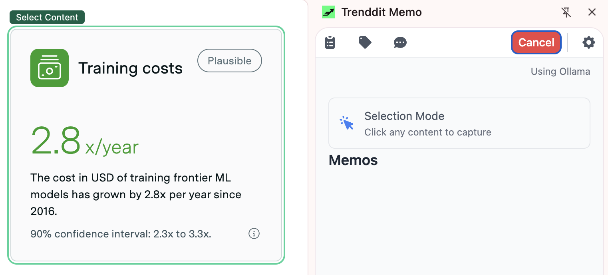
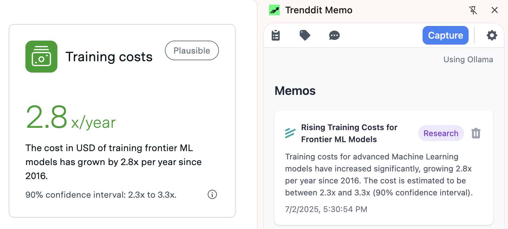
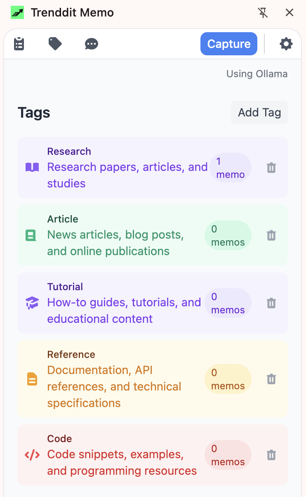
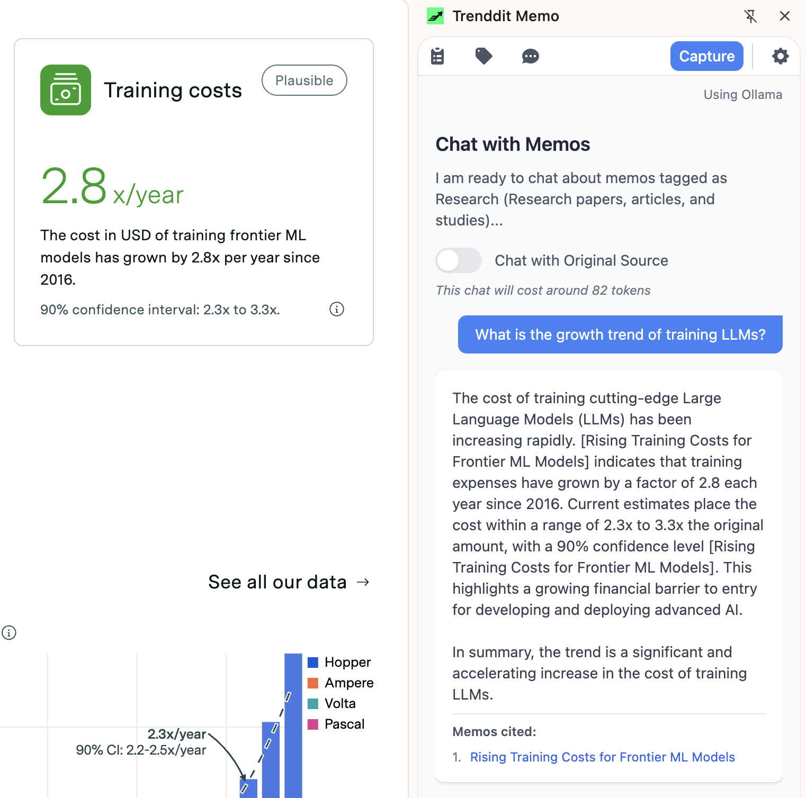
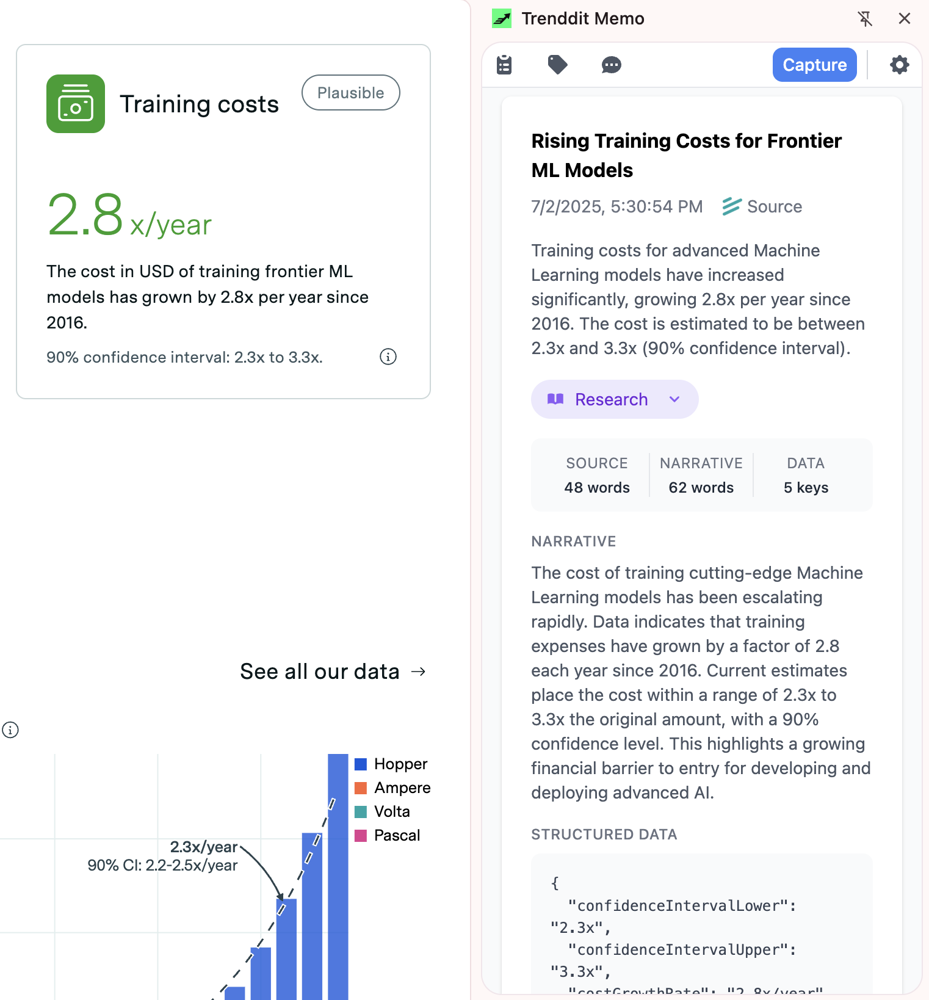
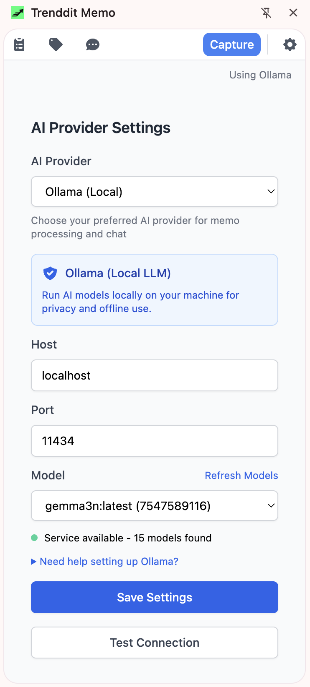

# Trenddit Memo

<div align="center">
  
  *We're building something we wished existed: turn your browsing into conversations with AI*
  
  [](https://opensource.org/licenses/MIT)
  [](https://developer.chrome.com/docs/extensions/)
  
  **Works with your favorite AI**  
  Anthropic Claude • OpenAI GPT • Google Gemini • Ollama (Local)
  
  [Get Started](#-get-started) • [How it Works](#-how-it-works) • [Setup Guide](#-setup-guide) • [What's Next](#-whats-next)
  
</div>

---

## 👋 What we're building

Hey! We're a small team who got frustrated with losing track of interesting stuff we found online. You know the feeling - you find an amazing article, bookmark it, and never see it again? 

We built Trenddit Memo to solve that. It's a Chrome extension that lets you capture content from any website, and then actually *talk* to it using AI. Think of it as having a conversation with your bookmarks.

**What makes us excited:**
- 🧠 **Your AI research assistant**: Capture content and let AI extract the important bits
- 🏷️ **It organizes itself**: AI suggests tags so you don't have to think about filing
- 💬 **Actually useful conversations**: Ask questions about your saved content like "what did I save about React performance?"
- 🔒 **Your data, your choice**: Everything stays local unless you want to sync
- 🏠 **Privacy option**: Use Ollama to run AI completely on your machine

---

## 🚀 Get Started

We tried to make this as simple as possible (though we're still learning!):

### 1️⃣ Install the Extension

```bash
# Grab our code
git clone https://github.com/yourusername/trenddit-memo.git
cd trenddit-memo

# Install and build (takes about 30 seconds)
npm install
npm run build
```

### 2️⃣ Load in Chrome

1. Go to `chrome://extensions/`
2. Turn on "Developer mode" (toggle in top right)
3. Click "Load unpacked" and choose the project folder
4. Pin us to your toolbar so we don't get lost!

### 3️⃣ Pick Your AI

We support 4 different AI providers because everyone has preferences:

| Provider | What we use it for | Privacy | Cost | Get Started |
|----------|-------------------|---------|------|-------------|
| **🤖 Anthropic Claude** | Deep thinking, complex stuff | Cloud | ~$0.01-0.10 per request | [Get your key →](https://console.anthropic.com/) |
| **🧠 OpenAI GPT** | Great all-rounder, creative tasks | Cloud | ~$0.01-0.05 per request | [Get your key →](https://platform.openai.com/api-keys) |
| **🎯 Google Gemini** | Super fast, handles images too | Cloud | ~$0.001-0.05 per request | [Get your key →](https://aistudio.google.com/app/apikey) |
| **🏠 Ollama (Local)** | Total privacy, runs on your machine | 100% Local | Free (after setup) | [Install Ollama →](https://ollama.ai) |

### 4️⃣ Take it for a spin!

1. Click our icon to open the side panel
2. Go to any webpage (maybe start with something interesting!)
3. Hit "Capture Content" and click on what you want to save
4. Watch the AI do its magic ✨
5. Try asking it questions about what you saved


*Select any content on a webpage by clicking after entering capture mode*

*Pro tip: Start with capturing a few different types of content (articles, product pages, etc.) then ask "what did I save about [topic]?" - it's pretty cool!*

---

## ✨ How it Works

Here's what we've built so far (and what we're excited about):

### 🎯 Content Capture That Actually Works
- **Point and click**: Just click on anything you want to save - text, images, entire sections
- **YouTube videos too!**: Automatically captures videos with transcripts and metadata
- **AI does the heavy lifting**: Automatically extracts titles, summaries, and the important stuff
- **Remembers everything**: Saves where you found it, when you saved it, even the site's favicon
- **Works everywhere**: Any website, any content (we've tested it everywhere we could think of!)


*Your captured content gets organized automatically with AI-generated summaries*

### 🏷️ Organization Without the Work  
- **AI suggests tags**: It's surprisingly good at figuring out how to categorize your stuff
- **23 smart categories**: From "To Read" and "Ideas" to "Work", "Learning", and "Entertainment"
- **Pretty icons**: Beautiful icons to make your collections actually look nice
- **Make it yours**: Create custom tags with your own colors and icons
- **Projects that make sense**: Group related content together (like "React Learning" or "Vacation Planning")


*Organize your content with beautiful tags and icons*

### 💬 Chat That's Actually Useful
- **Ask real questions**: "What did I save about performance optimization?" or "Compare the pricing I found"
- **Switch AI models**: Use Claude for deep analysis, GPT for creativity, Gemini for speed
- **See your sources**: Every answer links back to what you saved
- **Save good conversations**: Keep the useful discussions for later


*Have natural conversations with your saved content using AI*

### 🛡️ Privacy We Actually Care About
- **Your computer, your data**: Everything stored locally by default
- **Sync only if you want**: Chrome sync for backup, but it's optional
- **Secure API keys**: Encrypted storage, we never see them
- **No tracking**: We don't collect analytics or spy on your usage

### 🔧 The Technical Stuff (for the curious)
- **4 AI providers**: Anthropic, OpenAI, Google, and local with Ollama
- **Smart about tokens**: Won't blow through your API limits
- **Export everything**: Get your data out whenever you want
- **Offline option**: Run everything locally with Ollama if you prefer

---

## 📖 Setup Guide

We'll walk you through getting everything working (and share what we've learned):

### First-Time Setup

#### Getting Rolling
1. **Install** following our [Get Started](#-get-started) steps above
2. **Pick your AI** in Settings (we have thoughts on this below!)
3. **Test the connection** to make sure everything's talking
4. **Capture something** from any website to see how it feels

#### Which AI Should You Pick?

Honestly, it depends on what you're doing:

**For total privacy (our personal favorite for sensitive stuff):**
- **Ollama** keeps everything on your machine
- Zero API costs once you're set up
- Enhanced with automatic retry logic and error recovery
- Requires a bit of technical setup, but we have [comprehensive docs](docs/ollama-setup.md)

**For the best AI performance:**
- **Anthropic Claude** is incredible for deep analysis and complex reasoning
- **OpenAI GPT** is our go-to for creative tasks and general use  
- **Google Gemini** is super fast and handles images really well

*Real talk: We use different providers for different things. Claude for research, GPT for brainstorming, Gemini for quick questions, and Ollama when we're working with confidential stuff.*

### How We Use It

<div align="center">

**Capture stuff** → **AI processes it** → **Everything gets organized** → **Chat with your knowledge**

</div>

#### The Capture Flow
1. Click our icon to open the side panel
2. Find something interesting on any webpage
3. Hit "Capture Content" 
4. For regular pages: Everything lights up - click what you want to save
5. For YouTube: Just hit capture - we grab the video, transcript, and metadata automatically
6. We immediately save it and queue it for AI processing

#### What the AI Does  
1. Reads through your content automatically
2. Pulls out the title, summary, and key points
3. Suggests tags to keep things organized
4. Extracts structured data like prices, ratings, dates


*View detailed analysis of your saved content including AI-generated summaries and structured data*

#### Staying Organized
1. Check out the AI's suggested tags (they're usually pretty good!)
2. Add your own colors and icons to make it pretty
3. Group related stuff with tags like "work research" or "weekend project"
4. Filter by tags when you want to find something specific

#### The Fun Part: Chatting
1. Pick some tags to set the context
2. Ask questions like "what pricing did I find for project management tools?"
3. Get answers with links back to your sources
4. Save the useful conversations for later

### Tips & Tricks

<details>
<summary><b>🔧 AI Provider Quick Reference</b></summary>

**Anthropic Claude** 
- **Models**: Claude Opus 4, Sonnet 4, Sonnet 3.7, Sonnet 3.5v2, Haiku 3.5
- **When we use it**: Deep analysis, technical stuff, complex reasoning
- **API Key tip**: Starts with `sk-ant-`

**OpenAI GPT**  
- **Models**: o4-mini, GPT-4o, GPT-4.1, GPT-4.1-mini
- **When we use it**: Creative tasks, code generation, general brainstorming
- **API Key tip**: Starts with `sk-`

**Google Gemini**
- **Models**: Gemini 2.5 Pro, Gemini 2.5 Flash  
- **When we use it**: Quick questions, image processing, speed
- **API Key tip**: Starts with `AIza`

**Ollama (Local)**
- **Models**: Llama 2, Mistral, CodeLlama, tons more
- **When we use it**: Privacy-sensitive stuff, offline work, experimenting
- **Setup**: Install from [ollama.ai](https://ollama.ai) + enhanced retry logic for reliable connections


*Configure Ollama for completely private, local AI processing*

</details>

<details>
<summary><b>🏷️ Organization Magic</b></summary>

**We include 23 predefined tags organized by how you work:**

*Workflow & Action:*
- 📖 To Read - Content you want to come back to
- 🚧 In Progress - Active projects and tasks
- 💡 Ideas - Inspiration and brainstorming
- 📦 Archive - Reference material for later

*Content Types:*
- 🎬 Video - YouTube videos and video content
- 🛠️ Tools - Useful apps and services
- 📝 Meeting Notes - Work discussions
- 📰 News - Current events and articles

*Topic & Context:*
- 💼 Work - Professional content
- 🏠 Personal - Life and hobbies
- 📚 Learning - Educational resources
- 💰 Finance - Money matters
- Plus 11 more categories!

**Making your own tags:**
1. Hit "Manage Tags" in settings
2. Create whatever you want with colors and icons
3. They'll show up automatically when capturing
4. Organize however makes sense to you

</details>

<details>
<summary><b>💬 Getting Better Answers</b></summary>

**Questions that work really well:**
- "Summarize all my research on [topic]"
- "What are the pros and cons I found about [thing]?"
- "Find that detail about [specific thing] I saved"
- "Compare the different options I looked at"

**Pro tip - Use tag filters:**
1. Pick relevant tags before asking questions
2. AI only looks at that filtered content
3. Focused context = way better answers
4. Switch contexts by changing tag selection

**Cool features you might miss:**
- Toggle between seeing original vs. processed content
- Save conversations that were particularly useful
- Export chat history when you need it
- Check token usage if you're watching costs

</details>

### How People Actually Use This

| What For | The Flow | Why It's Awesome |
|----------|----------|------------------|
| **📈 Investment Research** | Save earnings reports → Tag by company → Ask "How's Tesla doing?" | AI connects dots across multiple sources |
| **🛒 Smart Shopping** | Save product reviews → Tag by category → Ask "Which laptop should I get?" | Compares everything you researched |
| **📚 Learning** | Save tutorials & YouTube videos → Tag by skill → Ask "How do I optimize React?" | Personal AI tutor from your saved content |
| **📰 Staying Informed** | Save articles → Tag by topic → Ask "What's happening with AI?" | Synthesizes trends from your reading |
| **🎬 Video Research** | Capture YouTube videos → Tag "Learning" → Ask "What did that tutorial say about hooks?" | Chat with video content using transcripts |

---

## 🏗️ Under the Hood (for the curious)

### Built on Modern Chrome Tech
- **Manifest V3**: Using Chrome's latest extension architecture
- **Service Worker**: Background processing that doesn't drain your battery
- **ES Modules**: Clean, maintainable code (we tried to keep it readable!)
- **CSP Compliant**: Chrome's security policies keep everything safe

### How the AI Magic Works
```
┌─────────────────┐     ┌──────────────┐     ┌─────────────┐
│  You interact   │────▶│ LLM Provider │────▶│ AI Provider │
│  with UI        │     │ Factory      │     │(Claude/GPT/ │  
└─────────────────┘     └──────────────┘     │Gemini/Ollama)│
         │                      │             └─────────────┘
         ▼                      ▼                     │
┌─────────────────┐     ┌──────────────┐             ▼
│  Your Data      │     │  Provider    │     ┌─────────────┐
│  (Local)        │     │ Configuration│     │   Chat &    │
└─────────────────┘     └──────────────┘     │ Processing  │
                                             └─────────────┘
```

### The Tech We're Proud Of
- **Multi-LLM Integration**: One unified interface that works with 4 different AI providers
- **Browser-First**: Everything uses native browser APIs (no Node.js dependencies)  
- **Clean Architecture**: Provider factory pattern makes adding new features easier
- **Provider Factory**: Simple interface to add new AI providers
- **Local-First Storage**: Your data stays on your machine using Chrome's storage APIs
- **Enhanced Error Handling**: Robust retry logic and graceful degradation
- **Performance Optimized**: Smart timeouts and caching for local and cloud providers

---

## 🛣️ What's Next

### ✅ What We've Built So Far

We're pretty excited about what we've shipped recently:

**YouTube Integration (Jan 2025) 🎉**
- ✅ Capture YouTube videos with one click
- ✅ Automatic transcript extraction
- ✅ Video metadata and thumbnails
- ✅ Smart handling of long transcripts
- ✅ Seamless chat with video content
- ✅ Works with all AI providers

**Multi-AI Support (2024)**
- ✅ Works with Anthropic Claude (our favorite for deep thinking)
- ✅ OpenAI GPT integration (great all-rounder)
- ✅ Google Gemini support (super fast)
- ✅ Switch between providers seamlessly
- ✅ Each provider gets its own models and settings
- ✅ Unified provider interface with factory pattern
- ✅ Comprehensive testing across all providers

**Enhanced Local AI (2024)**  
- ✅ Ollama integration for running AI on your machine
- ✅ Zero cloud dependencies if you want them
- ✅ Automatically discovers your installed models
- ✅ Works completely offline
- ✅ Enhanced retry logic with exponential backoff
- ✅ Comprehensive error handling and setup guidance
- ✅ Performance optimizations for local models

**Core Experience (2024)**
- ✅ Modern Chrome extension that actually works
- ✅ Point-and-click content capture
- ✅ 23 smart tag categories with beautiful icons
- ✅ Natural conversation interface
- ✅ Local storage with optional sync
- ✅ Robust provider configuration management

### 🚧 What We're Working On Now

**Making the AI Smarter**
- 🔄 Understanding the mood/sentiment of content
- 🔄 Grouping similar content automatically  
- 🔄 Better summaries and daily digests
- 🔄 Search that actually understands what you're looking for

**Beyond Text**
- 🔄 Reading and understanding PDFs
- 🔄 Describing images and screenshots
- 🔄 Capturing video transcripts
- 🔄 Processing audio content

**Developer Experience**
- 🔄 Enhanced testing framework with browser compatibility
- 🔄 Performance monitoring and optimization tools
- 🔄 Better error reporting and debugging utilities

### 🎯 Next Quarter (Q2-Q3 2025)

We get requests for these a lot:

**More Content Sources** (YouTube ✅ Done!)
- 📋 Podcast transcripts and audio content
- 📋 Twitter/X threads (the good ones!)
- 📋 Social media content that's worth saving
- 📋 Import from emails and documents

**Automation That Helps**  
- 📋 AI that can actually do tasks based on your content
- 📋 Auto-filing and smart notifications
- 📋 Content recommendations
- 📋 Templates for common workflows

**Team Features** (lots of requests for this!)
- 📋 Shared workspaces for teams
- 📋 Content sharing and collaboration
- 📋 Real-time sync across team members
- 📋 Proper permission management

### 🌟 The Big Ideas (Late 2025+)

These are the ambitious ones we're thinking about:

**Deep Integration**
- 📋 Connect with your calendar and tasks
- 📋 Integrate with other productivity tools
- 📋 API for developers to build on top
- 📋 System-level integrations

**Next-Level AI**
- 📋 Multi-modal processing (text, images, audio all together)
- 📋 AI that can reason and make recommendations
- 📋 Predictive content discovery
- 📋 Custom AI training on your content

**Enterprise Ready**
- 📋 SSO and enterprise authentication
- 📋 Advanced security and compliance
- 📋 Usage analytics and insights
- 📋 Custom deployment options

*Want to influence what we build next? [Let us know what you need!](https://github.com/yourusername/trenddit-memo/discussions)*

---

## 🔧 For Developers

Want to hack on this with us? We'd love the help!

### What You'll Need
- Node.js 16+ (we use the latest LTS)
- Chrome Browser (for testing, obviously)
- AI Provider API Keys (optional, but helpful for testing)

### Getting Set Up
```bash
# Grab the code and get running
git clone https://github.com/yourusername/trenddit-memo.git
cd trenddit-memo
npm install

# Build it (takes about 30 seconds)
npm run build

# Make sure everything works
npm test

# Development mode (rebuilds automatically)
npm run build --watch
```

### Testing Things Out
```bash
# Run all our tests
npm test

# Or run specific test suites
npm run test:syntax      # Make sure we didn't break JavaScript
npm run test:simple     # Core functionality tests  
npm run test:browser    # Open test.html in your browser

# We also have comprehensive provider tests
# (Check tests/ folder for individual provider test files)
```

### Want to Contribute?

We'd be thrilled! Here's how we like to work:

1. **Fork the repo** and create a feature branch
2. **Make your changes** (and add tests if you can!)
3. **Run the tests** to make sure nothing breaks
4. **Submit a pull request** with a description of what you built

We try to review PRs quickly and give helpful feedback. Don't worry about making it perfect - we can iterate together!

*Check out our [issues](https://github.com/yourusername/trenddit-memo/issues) for ideas on what to work on.*

---

## 📊 The Technical Details

### How It Performs
- ⚡ **Content capture**: Usually under 2 seconds (we're pretty proud of this)
- 📦 **Extension size**: Under 2MB with all 4 AI providers included
- 🔋 **Memory usage**: About 10MB in the background (barely noticeable)
- 🚀 **AI responses**: 2-10 seconds for cloud, varies locally with Ollama
- 📊 **Smart processing**: We keep it under 4096 tokens to save on costs
- 🔄 **Enhanced reliability**: Automatic retry logic with exponential backoff
- 🎯 **Provider switching**: Seamless switching between all 4 providers

### Privacy (This is Important to Us)
- 🔒 **Local-first**: Everything lives on your computer unless you choose sync
- 🔐 **Secure API keys**: Encrypted storage, we never see or log them
- 📵 **No tracking**: We don't collect analytics or spy on what you do
- 🛡️ **Browser security**: Chrome's Content Security Policy keeps things safe
- 🔄 **Optional sync**: Only lightweight metadata if you want cross-device access
- 🏠 **Total privacy mode**: Use Ollama to never send data anywhere

---

## 🤝 Community & Support

### Need Help?
- 📖 **Start here**: This README covers most things
- 🐛 **Found a bug?**: [Report it here](https://github.com/yourusername/trenddit-memo/issues) and we'll fix it
- 💬 **Questions or ideas?**: [Join our discussions](https://github.com/yourusername/trenddit-memo/discussions)
- 📧 **Direct line**: [Drop us an email](mailto:support@trenddit.com) if you need help

### Join Us
- ⭐ **Star us** if this is useful (it really helps!)
- 🍴 **Fork it** to make your own version
- 📢 **Tell others** who might find this helpful
- 🤝 **Contribute** - we love working with the community

---

## 📄 License

MIT License - use it however you want! See [LICENSE](LICENSE) for the legal details.

---

## 🙏 Thanks

We're standing on the shoulders of giants here:
- **Chrome Extensions Team** - for building a platform that lets us do this
- **AI Provider Teams** - Anthropic, OpenAI, Google, and Ollama for amazing APIs
- **Open Source Community** - for inspiration and countless hours of learning
- **Early Users** - for trying our rough early versions and giving honest feedback

Seriously, thank you to everyone who's helped make this possible.

---

<div align="center">
  
  **Ready to give it a try?**
  
  [Get Started](#-get-started) • [How it Works](#-how-it-works) • [What's Next](#-whats-next)
  
  *Making your browsing smarter, one conversation at a time*
  
</div>