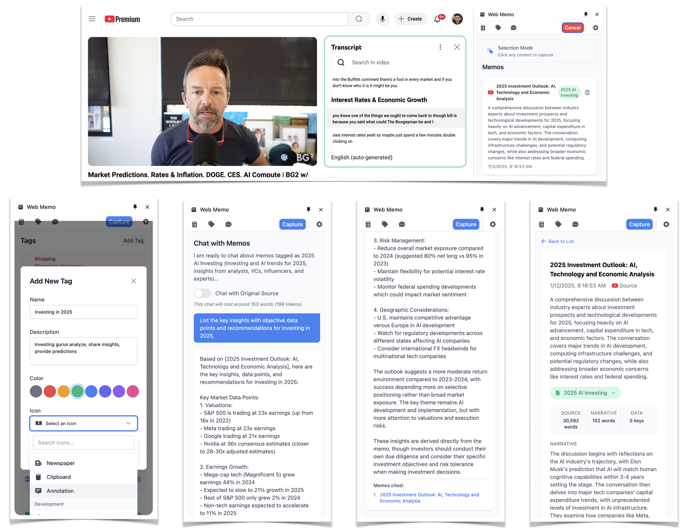

# Trenddit Memo

<div align="center">
  
  *An evolving Chrome extension that bridges web content with conversational AI*
  
  [](https://opensource.org/licenses/MIT)
  
  Built with Anthropic Claude • OpenAI GPT • Google Gemini
  
  [Quick Start](#quick-start) • [Features](#features) • [Development](#development) • [Contributing](#contributing)
  
</div>

---

## About This Project

Trenddit Memo began as an exploration into making web content more conversational. Through rapid iteration, we've developed a Chrome extension that captures web content and enables natural language interactions through multiple AI providers.

Our approach has been to build incrementally, learning from each implementation cycle. What started as a simple content capture tool has grown into a multi-provider AI interface, though we recognize there's much more to explore.

### Current Capabilities

- **Multi-Provider Integration**: Working implementations for Anthropic Claude, OpenAI GPT, and Google Gemini
- **Content Conversations**: Early success in making saved web pages queryable through natural language
- **Organizational Systems**: Developing tag-based categorization with growing icon library
- **Source Attribution**: Connecting AI responses back to original content
- **Local-First Architecture**: Prioritizing user data sovereignty

---

## 📸 See It In Action

<div align="center">
  
  ### Capture → Process → Chat
  
  
  
</div>

### Real-World Use Cases

<table>
<tr>
<td width="50%">

**📈 Investment Research**
- Capture earnings reports and analysis
- Chat with your research: "What were the key risks mentioned?"
- AI cites specific memos in responses

</td>
<td width="50%">

**🛒 Smart Shopping**
- Save product reviews and comparisons
- Ask: "Which laptop had the best battery life?"
- Get AI-powered purchase recommendations

</td>
</tr>
<tr>
<td width="50%">

**📚 Learning & Development**
- Capture tutorials and documentation
- Query: "How do I implement authentication?"
- AI synthesizes information from multiple sources

</td>
<td width="50%">

**📰 News & Content Curation**
- Save articles across different topics
- Ask: "What are the main themes this week?"
- Get intelligent summaries with citations

</td>
</tr>
</table>

---

## 🚀 Quick Start

### 1️⃣ Install the Extension

```bash
# Clone the repository
git clone https://github.com/yourusername/trenddit-memo.git
cd trenddit-memo

# Install dependencies
npm install

# Build the extension
npm run build
```

### 2️⃣ Load in Chrome

1. Open `chrome://extensions/`
2. Enable "Developer mode" (top right)
3. Click "Load unpacked"
4. Select the `trenddit-memo` directory

### 3️⃣ Choose Your AI Provider

<table>
<tr>
<th>Provider</th>
<th>Models Available</th>
<th>Best For</th>
<th>Get API Key</th>
</tr>
<tr>
<td>🤖 <b>Anthropic Claude</b></td>
<td>Claude Opus 4, Sonnet 4, Sonnet 3.7, Sonnet 3.5v2, Haiku 3.5</td>
<td>Complex analysis, reasoning, coding</td>
<td><a href="https://console.anthropic.com/">console.anthropic.com</a></td>
</tr>
<tr>
<td>🧠 <b>OpenAI GPT</b></td>
<td>GPT-4o-mini, GPT-4o, GPT-4.1, GPT-4.1-mini</td>
<td>Creative writing, general tasks</td>
<td><a href="https://platform.openai.com/api-keys">platform.openai.com</a></td>
</tr>
<tr>
<td>🎯 <b>Google Gemini</b></td>
<td>Gemini 2.5 Pro, Gemini 2.5 Flash</td>
<td>Multimodal content, Google ecosystem</td>
<td><a href="https://aistudio.google.com/app/apikey">aistudio.google.com</a></td>
</tr>
</table>

### 4️⃣ Start Capturing!

1. Click the Trenddit icon to open the side panel
2. Navigate to any webpage
3. Click "Capture Content" and select what to save
4. Watch as AI processes and organizes your content

---

## Features

### Content Capture
We've refined the capture experience through multiple iterations. The system now supports visual element selection across websites, with ongoing improvements to extraction accuracy and cross-site compatibility.

### Organization & Retrieval
Our tagging system has evolved from basic categorization to include custom colors, icons, and hierarchical structures. The AI-assisted categorization continues to improve as we refine the underlying models.

### Conversational Interface
The chat functionality represents our most significant recent progress. We've successfully integrated three major AI providers, each bringing unique strengths to content interaction and analysis.

### Data Architecture
We've prioritized user data sovereignty with local-first storage, while developing optional sync capabilities. The export and backup systems ensure users maintain full control over their captured knowledge.

---

## 📖 User Guide

### Basic Workflow

<table>
<tr>
<td width="25%" align="center">
  
  **1. Capture**
  
  Click any element on a webpage to save it
  
</td>
<td width="25%" align="center">
  
  **2. Process**
  
  AI extracts key information and suggests tags
  
</td>
<td width="25%" align="center">
  
  **3. Organize**
  
  Review and adjust tags as needed
  
</td>
<td width="25%" align="center">
  
  **4. Chat**
  
  Have conversations with your saved content
  
</td>
</tr>
</table>

### Advanced Features

<details>
<summary><b>🔧 Provider Configuration</b></summary>

Each AI provider has specific settings you can customize:

**Anthropic Claude**
- Models: Claude Opus 4, Sonnet 4, Sonnet 3.7, Sonnet 3.5v2, Haiku 3.5
- Best for: Deep analysis, technical content, complex reasoning

**OpenAI GPT**
- Models: GPT-4o-mini, GPT-4o, GPT-4.1, GPT-4.1-mini
- Best for: Creative tasks, code generation, general productivity

**Google Gemini**
- Models: Gemini 2.5 Pro, Gemini 2.5 Flash
- Best for: Multimodal content, fast responses, Google ecosystem integration

</details>

<details>
<summary><b>🏷️ Tag Management</b></summary>

**Predefined Categories Include:**
- 📚 Learning & Education
- 💼 Work & Productivity
- 🛒 Shopping & Reviews
- 📈 Finance & Investment
- 🎮 Entertainment & Gaming
- 🍳 Food & Recipes
- ✈️ Travel & Places
- And 60+ more...

**Custom Tags:**
1. Click "Manage Tags" in settings
2. Create new tag with name, color, and icon
3. Tags automatically appear in capture workflow

</details>

<details>
<summary><b>💬 Chat Tips</b></summary>

**Effective Queries:**
- "Summarize all my research on [topic]"
- "What are the pros and cons mentioned in my saved reviews?"
- "Find information about [specific detail] in my memos"

**Using Tag Filters:**
1. Select relevant tags before chatting
2. AI will only reference filtered memos
3. More focused context = better responses

</details>

---

## 🛠️ Technical Details

### Architecture Overview

```
┌─────────────────┐     ┌──────────────┐     ┌─────────────┐
│  Content Script │────▶│  Background  │────▶│ AI Provider │
│  (Capture UI)   │     │   Service    │     │   (4 LLMs)  │
└─────────────────┘     └──────────────┘     └─────────────┘
         │                      │                     │
         ▼                      ▼                     ▼
┌─────────────────┐     ┌──────────────┐     ┌─────────────┐
│   Side Panel    │     │   Storage    │     │   API Keys  │
│  (Main UI)      │     │ (Local/Sync) │     │  (Secure)   │
└─────────────────┘     └──────────────┘     └─────────────┘
```

### Key Technologies
- **Chrome Manifest V3**: Modern service worker architecture
- **ES Modules**: Clean, maintainable code structure
- **Provider Factory Pattern**: Extensible multi-LLM integration
- **Repository Pattern**: Abstracted data access layer
- **Browser-Compatible APIs**: Native fetch for all providers
- **CSP Compliance**: Secure content handling

---

## Development Journey

### Foundation Phase (Recently Completed)
Our initial focus was establishing stable multi-provider AI integration. This phase taught us valuable lessons about browser extension architecture and API compatibility across different providers.

**Key Achievements:**
- Successfully integrated three major AI providers with unified interface
- Developed extensible provider factory pattern for future additions
- Implemented local-first storage with privacy-focused design
- Created visual content capture system through iterative refinement

### Current Sprint (Active Development)
We're expanding the intelligence layer while refining existing capabilities based on user feedback and technical learnings.

**In Progress:**
- Semantic search implementation for content discovery
- Enhanced content analysis with sentiment and topic modeling
- Local LLM integration experiments (Ollama)
- Smart summary generation for daily/weekly content digests

### Next Horizon (Early 2025)
Our roadmap continues to evolve based on community input and technical possibilities we discover along the way.

**Planned Explorations:**
- Rich media processing (video transcripts, PDFs, audio content)
- Social media content integration experiments
- Collaborative features for shared knowledge bases
- Advanced workflow automation

*We remain committed to rapid iteration while acknowledging that each new capability brings its own challenges and learning opportunities.*

---

## Technical Architecture

### Design Philosophy
Our architecture emerged from practical constraints and security requirements inherent to browser extensions. Each design decision balances extensibility with performance, leading to patterns that support rapid iteration.

### Provider Abstraction
The multi-LLM integration relies on a unified interface that abstracts provider-specific implementations:

```javascript
// Unified provider interface
export class LLMProvider {
    async initialize(apiKey) { /* Provider initialization */ }
    async chat(messages, options) { /* Chat implementation */ }
    async processMemo(content, options) { /* Content processing */ }
    calculateTokens(text) { /* Token calculation */ }
}
```

This abstraction enables provider switching without architectural changes, though each integration revealed unique considerations for token handling, rate limiting, and response formatting.

### Processing Flow
Content moves through a pipeline designed for reliability and user feedback:

**Capture** → **Extract** → **Process** → **Store** → **Query**

Each stage includes error handling and progress indication, learning from earlier versions where silent failures confused users.

### Security Approach
Browser extension security constraints shaped our implementation:

- All provider communication uses native browser APIs
- API keys remain isolated in secure Chrome storage
- Content sanitization prevents XSS vulnerabilities
- CSP compliance ensures script integrity

### Performance Considerations
We've optimized for perceived performance rather than raw speed:

- Lazy provider loading reduces initial startup time
- Token-aware processing prevents API quota issues
- Local-first storage eliminates network dependencies for core functionality
- Progressive enhancement ensures functionality on slower devices

---

## 🤝 Contributing

We love contributions! See our [Contributing Guide](CONTRIBUTING.md) for details.

### Quick Contribution Guide

```bash
# Fork and clone
git clone https://github.com/yourusername/trenddit-memo.git

# Create feature branch
git checkout -b feature/amazing-feature

# Make changes and test
npm install
npm run build

# Commit and push
git commit -m "Add amazing feature"
git push origin feature/amazing-feature
```

### Development Tips
- Follow existing code patterns
- Add tests for new features
- Update documentation
- Check `specs/` folder for detailed requirements

---

## 📊 Performance & Privacy

### Performance Metrics
- ⚡ **Content Capture**: <2 seconds average processing time
- 📦 **Extension Size**: <2MB with all providers
- 🔋 **Memory Usage**: Minimal background impact (~10MB)
- 🚀 **AI Response Time**: 2-10 seconds (provider dependent)
- 🏗️ **Build Time**: <5 seconds with ESBuild
- 📊 **Token Limit**: 4096 tokens per memo for optimal processing

### Privacy & Security
- 🔒 **API Keys**: Encrypted local storage, never transmitted
- 📵 **No Tracking**: Zero analytics or data collection
- 💾 **Local-First**: All content stored on your device
- 🔐 **Optional Sync**: Chrome's secure sync for metadata only
- 🛡️ **CSP Protection**: Content Security Policy enforcement
- 🚫 **No External Dependencies**: All providers use native browser APIs

---

## 📄 License

MIT License - see [LICENSE](LICENSE) for details.

---

## Acknowledgments

This project builds upon the work of many others. The Chrome Extensions platform provided the foundation, while the AI provider teams created the APIs that make content conversations possible.

The open source community continues to inspire our development approach, and early users have provided invaluable feedback that shapes each iteration.

We remain grateful for the opportunity to explore these technologies and contribute to the broader conversation about AI-assisted knowledge management.

---

<div align="center">
  
  *Your feedback shapes our direction*
  
  [Issues](https://github.com/yourusername/trenddit-memo/issues) • [Discussions](https://github.com/yourusername/trenddit-memo/discussions) • [Contributing](CONTRIBUTING.md)
  
</div>